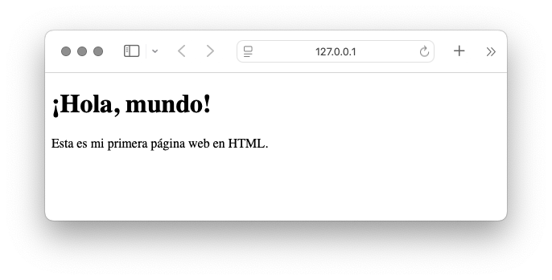

# ¿Qué es HTML?

HTML (HyperText Markup Language) es el **lenguaje de marcado** que se utiliza para **crear y estructurar páginas web**. No es un lenguaje de programación, sino un lenguaje de marcado, lo que significa que se usa para **organizar y etiquetar el contenido** de una página (texto, imágenes, enlaces, etc.) para que los navegadores web lo puedan mostrar correctamente.

## ¿Qué hace HTML?
- Estructura el contenido (títulos, párrafos, listas, tablas, etc.)
- Contiene una serie de elementos HTML (p, a, div, etc.)
  - Los elementos HTML están representados por etiquetas
    - p, a, div, span, h1-h6, etc.
 - Los elementos HTML le dicen al navegador cómo mostrar el contenido
 - Las etiquetas HTML etiquetan piezas de contenido como "títulos", "párrafo", "tabla", "listas", etc.
- Inserta imágenes, vídeos y otros recursos multimedia
- Crea enlaces entre páginas
- Define formularios para recoger datos del usuario

### Ejemplo básico de una página en HTML:
```html
<!DOCTYPE html>
<html>
<head>
  <title>Mi primera página</title>
</head>
<body>
  <h1>¡Hola, mundo!</h1>
  <p>Esta es mi primera página web en HTML.</p>
</body>
</html>
```


---

### Explicación del ejemplo:

- `<!DOCTYPE html>`
  ➤ Define que el documento es **HTML5**, la versión actual del estándar HTML.

- `<html>`
  ➤ Es el **elemento raíz** del documento HTML. Todo el contenido va dentro de él.

- `<head>`
  ➤ Contiene **información sobre el documento**, como el título, los metadatos y enlaces a archivos externos (CSS, scripts...).

- `<title>`
  ➤ Define el **título que aparece en la pestaña del navegador**. No se muestra en el contenido de la página.

- `<body>`
  ➤ Contiene todos los **elementos visibles de la página web**, es decir, lo que el usuario ve en su navegador.

- `<h1>`
  ➤ Define un **título o encabezado principal**. Hay desde `<h1>` (el más importante) hasta `<h6>` (el menos).

- `<p>`
  ➤ Define un **párrafo de texto**.

¡Claro! Aquí tienes una versión mejorada y más clara de tu texto, con mejor estructura, lenguaje más natural y algo de formato para facilitar la lectura:

---

## HTML Tags (Etiquetas HTML)

Las **etiquetas HTML** son los componentes básicos del lenguaje HTML. Se escriben entre **corchetes angulares**:

```html
<tagname>El contenido va aquí...</tagname>
```

### Características principales:
- Las etiquetas HTML suelen venir en **pares**, como `<p>` (etiqueta de apertura) y `</p>` (etiqueta de cierre).
- La **etiqueta de apertura** marca el inicio del contenido.
- La **etiqueta de cierre** es igual que la de apertura, pero con una **barra inclinada** `/` antes del nombre:
  Ejemplo: `<p>Texto</p>`

---

## Navegadores

El propósito de un navegador web (como **Chrome, Edge, Firefox o Safari**) es **leer documentos HTML y mostrarlos** en pantalla de forma visual.

- El navegador **no muestra las etiquetas HTML**, pero **las interpreta para dar formato** al contenido (por ejemplo, títulos, párrafos, listas, etc.).

---

## La declaración `<!DOCTYPE>`

La declaración `<!DOCTYPE>` le indica al navegador **el tipo de documento HTML** que se está utilizando, y ayuda a que se **muestre correctamente**.

### Puntos clave:
- Debe aparecer **una sola vez** y **al principio del documento**, **antes** de la etiqueta `<html>`.
- **No distingue mayúsculas de minúsculas**.
- Para HTML5, la declaración estándar es:
  ```html
  <!DOCTYPE html>
  ```
